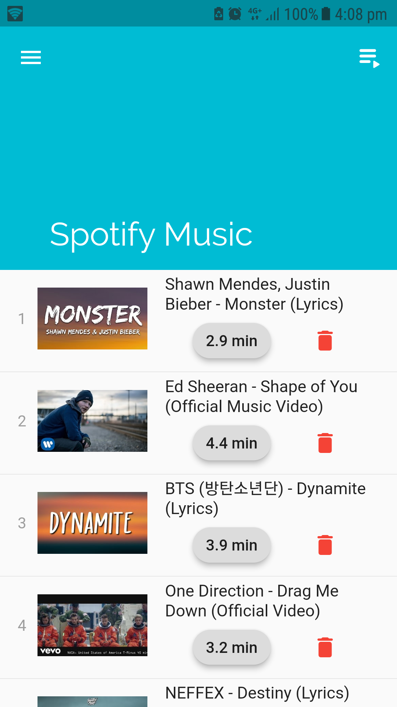
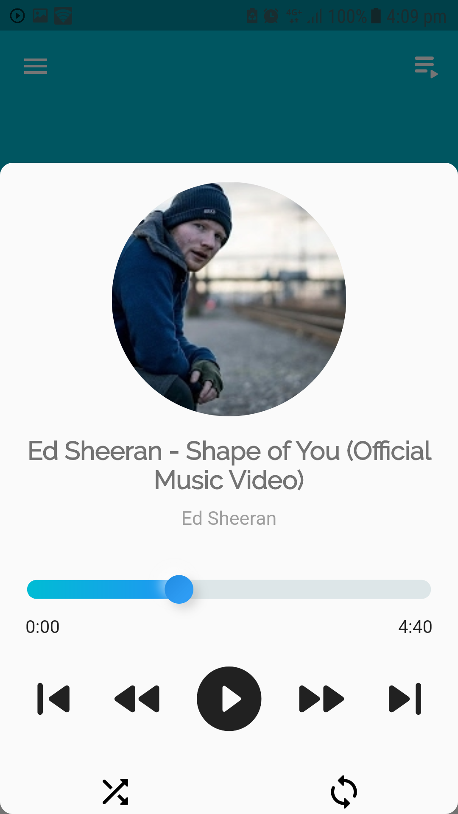
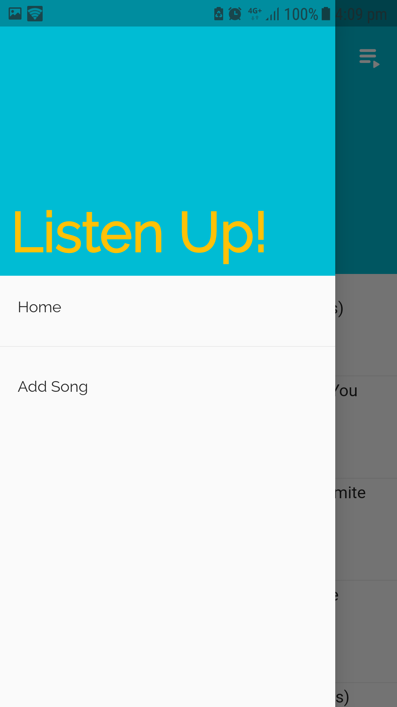
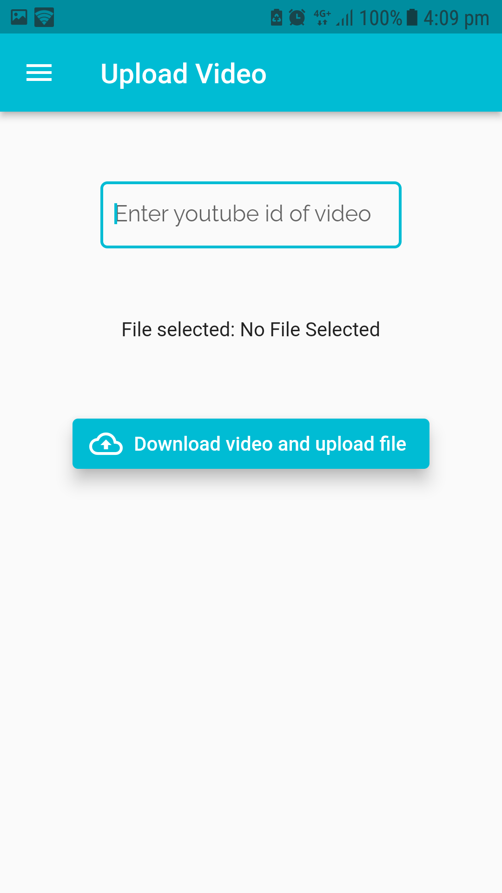
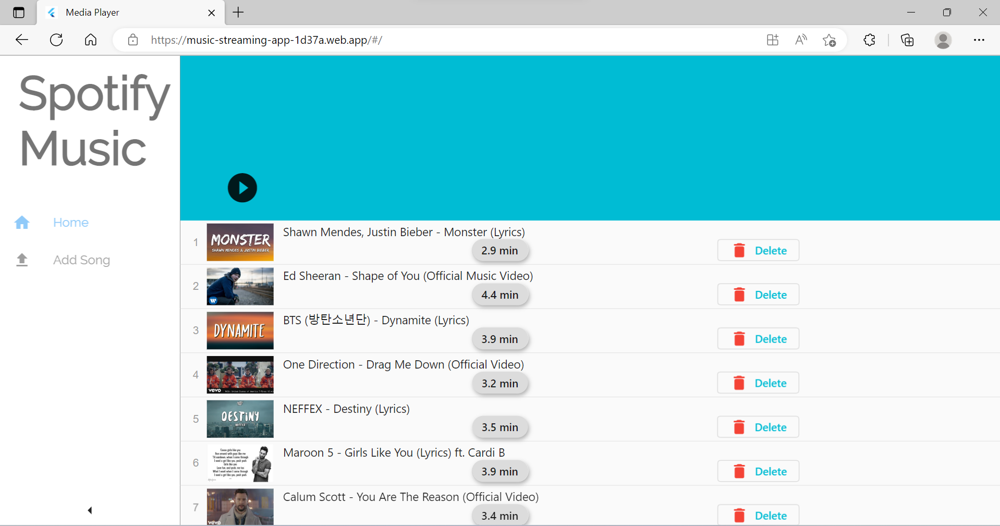
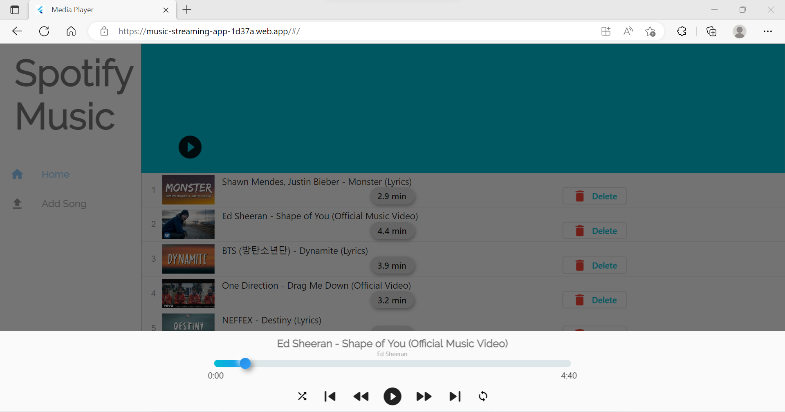
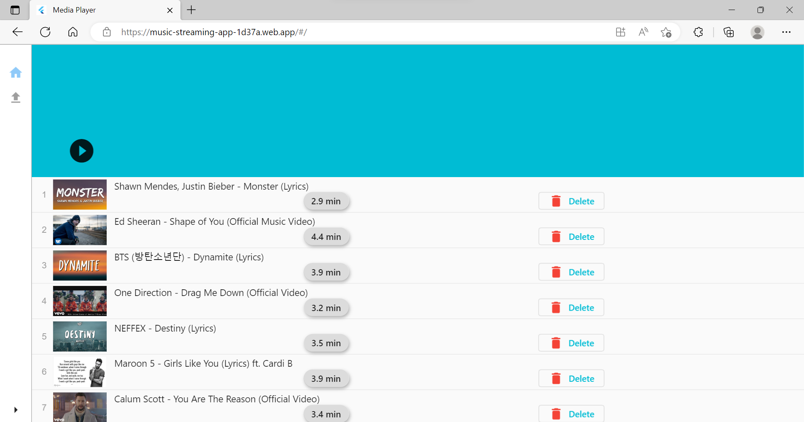

# Spotify🎵 - Music Streaming App

A responsive music streaming app for mobile and web build upon flutter, dart and firebase.

The app uses ```youtube_explode_dart``` package to download the music audio and then that audio is temporarly stored in storage till it is uploaded to firebase storage. streamable link from firebase storage is provided which is used by ```assets_audio_player```(another flutter package) to play music on web and mobile.

The idea for the project and actual implemention is completely mine. Only the name "Spotify" is copied to answer the question - "What does this app do?" and gain some attraction whynot.  I am Welcoming more contributers.
This project is created with the intention of listening to music while coding. Because coding without music is just pure bad!

## Libraries used
***
```assets_audio_player``` - for playing music in background on mobile and web.

```firebase_core & firebase_storage``` - for connecting and manipulating files in firebase storage.

```youtube_explode_audio```- golden library. Without this package making this project would not have been possible. PROPS to the guy who created this package.

```provider``` - for managing all the audio files in list and providing it to the complete application.

```path_provider``` - to get the application documents directory while it is being uploaded to firebase storage.

```flutter_neumorphic & shimmer & progress_indicaters``` - for UI.

```side_navigation``` - to build the side navigation bar for webapp.

```cupertino_icons``` - don't know its just there.

## Screenshots
***

### Mobile

<div>







</div>

</br>
</br>
</br>
</br>
</br>
</br>
</br>
</br>
</br>
</br>
</br>
</br>
</br>
</br>
</br>
</br>
</br>
</br>
</br>
</br>
</br>
</br>
</br>
</br>
</br>
</br>
</br>
</br>
</br>
</br>
</br>
</br>
</br>
</br>
</br>
</br>
</br>

### Web







## Vision for future
***

- Adding authentication so each user can save and listen to his own music. Can be easily implemented using firebase authentication and some manipulations while saving files in storage.

- Improving the UI on web (on mobile its pretty good). Maybe by using canvas kit instead of html renderer.

## Thanks for viewing
***
>Feel free to reach out to me on github or mail mukaldadhwal@gmail.com. Thanks You Very Much😄!!
